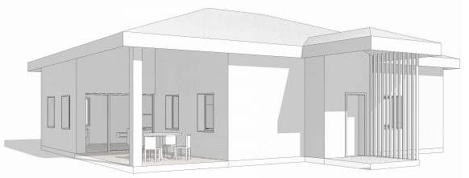
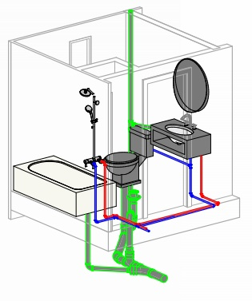
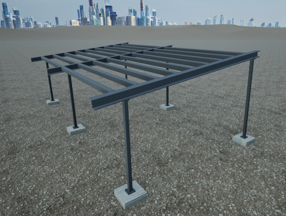

# Andrew Samuda's Portfolio 

Welcome to my online portfolio! Here you'll find a collection of my past work, sketches, and projects.

---

## About Me
Hi, I'm **Andrew**, an experienced Civil Engineer and Draftsman with several years of experience in designing 
and drafting precise, detailed engineering and architectural plans. I am committed to delivering accurate, 
high-quality drawings that align with project requirements, standards, and timelines.

---

## My Work

### Projects & Drawings
Here are some of my recent works:

- **2 Bedroom Architectual Project** – [View PDF](/portfolio/2 bedroom house.pdf)  
  
  Simple illustration of a 2-bedroom house with 3D views.

- **3 Bedroom MEP Project** – [View PDF](/portfolio/3 Bedroom MEP Project.pdf)  
  
  Residential project illustrating HVAC, plumbing, and electrrical plans.

- **Residential Canopy Project** – [View PDF](/portfolio/Steel Canopy.pdf)  
  
  Plans and fabrication shop drawings for a small steel canopy.

---

## Skills
- Autodesk Revit 
- Autodesk Civil 3D  
- Autodesk AutoCAD  
- Autodesk Robot Structural Analysis

---

## Contact Me
- Email: [draftingsolutions876@gmail.com](mailto:your.email@example.com)  

---

## Notes
- Feel free to browse, download, or contact me for collaborations.
