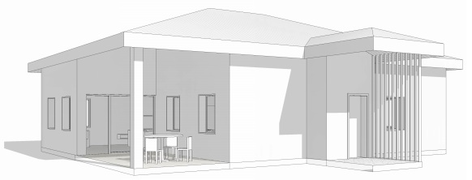
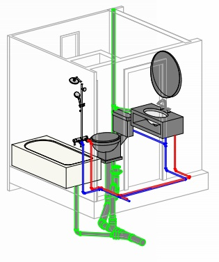
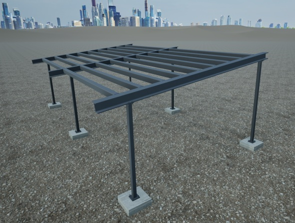
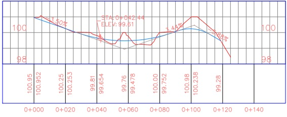

# Drafting Solutions

Civil engineering and technical drafting services based in Jamaica. This repository hosts the Drafting Solutions portfolio website.

---

## About
Drafting Solutions designs and drafts precise, detailed engineering and architectural plans. We are committed to
delivering accurate, high-quality drawings that align with project requirements, standards, and timelines.

---

## Selected Work

- **2 Bedroom Architectural Project** – [View PDF](portfolio/2-bedroom-house.pdf)
  

  Simple illustration of a 2-bedroom house with 3D views.

- **3 Bedroom MEP Project** – [View PDF](portfolio/3-Bedroom-MEP-Project.pdf)
  

  Residential project illustrating HVAC, plumbing, and electrical plans.

- **Residential Canopy Project** – [View PDF](portfolio/steel-canopy.pdf)
  

  Plans and fabrication shop drawings for a small steel canopy.

- **Chudleigh Road Profiles** – [View PDF](portfolio/chudleigh-road-profiles.pdf)
  

  Longitudinal profiles prepared to support road design and site coordination.

---

## Software
- Autodesk Revit
- Autodesk Civil 3D
- Autodesk AutoCAD
- Autodesk Robot Structural Analysis

---

## Contact
- Email: [draftingsolutions876@gmail.com](mailto:draftingsolutions876@gmail.com)
- Tel: 876-817-3220
